# Maksim Babayan

**Abu Dhabi** · Builder · Shipping > Talking

---

I write code and manage people who write code.  
Occasionally both compile on the first try.  
I'm told not to get used to either.

---

### Stack

**C** · **JavaScript** · **React** · **Python** · **SQL** · **Blender** · **Photoshop**

**Bonus skills:** Suffering in silence, explaining to designers why their 47px border-radius won't work on mobile, and pretending I understand Arabic coffee small talk.

---

### Currently deep in:

**Node.js / Fastify** · **Mobile UI/UX** · **Magento / Shopify / WordPress**  
*(yes, someone has to do the dirty work and wrestle with 2012 plugins)*

Also trying to convince myself that another **Figma → Code** rabbit hole is a good life decision.

---

### Stats

<div align="center">



</div>

### Connect with me

[](https://me.maxus.life)
[](https://www.linkedin.com/in/maxim-babayan-429181273/)
[](https://www.instagram.com/maxim.babayan/)
[](https://t.me/baduser)

---

<details>
<summary><b>⚙️ How the stats card works</b></summary>

The card above is **self-hosted** — no Vercel, no third-party stat services.
A Python script queries the GitHub GraphQL API and renders
[`assets/github-stats.svg`](./assets/github-stats.svg), which the README
embeds via a relative path. A GitHub Action regenerates it every ~6 hours.

#### How it works

1. `scripts/generate_stats.py` sends a few GraphQL queries (profile totals,
   paginated repository list with languages, and per-year commit
   contributions) using only the Python standard library.
2. It renders a deterministic terminal-style SVG. If nothing changed except
   the footer timestamp, the file is left untouched so no commit happens.
3. `.github/workflows/update-stats.yml` runs on a 6-hour schedule (and via
   manual dispatch), commits the SVG as `github-actions[bot]` only when it
   actually changed.

#### Run it locally

```bash
GITHUB_TOKEN=$(gh auth token) python3 scripts/generate_stats.py
# or with any personal access token:
GITHUB_TOKEN=ghp_xxx python3 scripts/generate_stats.py <username>
```

Requires Python 3.10+ and no third-party packages.

#### Change the username

Pass it as the first CLI argument (the workflow passes
`${{ github.repository_owner }}` automatically), or edit
`DEFAULT_USERNAME` in `scripts/generate_stats.py`.

#### Customize the design

All visual knobs live at the top of the rendering section in
`scripts/generate_stats.py`: the `COLORS` dict, `FONT_SIZE`,
`LINE_HEIGHT`, `WIDTH`, and `BAR_CHARS`. Sections are emitted line by line
in `render_svg()`, so reordering or removing blocks is straightforward.
No external fonts or JavaScript are used.

#### Trigger the workflow manually

**Actions → Update GitHub Stats → Run workflow**, or:

```bash
gh workflow run update-stats.yml
```

#### API limitations (honest numbers only)

- **Repos, stars, followers, PRs, issues** — exact, from the GraphQL API
  (public, owned repositories; forks are excluded from stars/languages).
- **Commits** — GitHub's *contribution* count (default-branch commits,
  summed per calendar year). With the built-in `GITHUB_TOKEN` this covers
  public activity only; private contributions are not visible and are not
  guessed. It matches the profile contribution graph, not `git log` totals.
- **Languages** — byte share reported by GitHub's Linguist across owned
  non-fork repositories, top 5.

</details>
