# Maksim Babayan

**Abu Dhabi** · Builder · Shipping > Talking

---

I write code and manage people who write code.  
Occasionally both compile on the first try.  
I'm told not to get used to either.

---

### Connect with me

